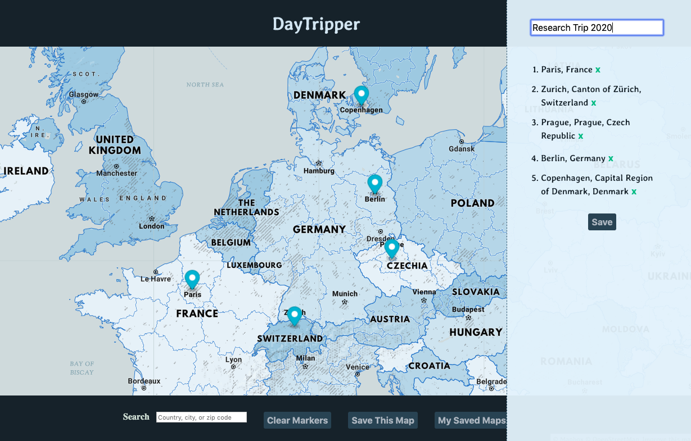

# Daytripper

## Introduction

Daytripper is a tool inspired by a love of traveling, designed for fun and exploration. Use it to plot out potential itineraries, save & remember noteworthy locales and past adventures, or just to daydream!

As a user, you can add and remove map markers with a mouse-click, save them to aliased "trips," recall & edit your saved trips, and add details. The plan is to continue expanding the functionality to include text search, further detailing of locations (such as attractions, travel & accommodation price estimates between locations) and improved UI elements.

## Implementation

### React + MapboxGL

This project is built using Node, React, and [MapboxGL](https://docs.mapbox.com/mapbox-gl-js/api/), with plans to incorporate PostgreSQL for the database.
