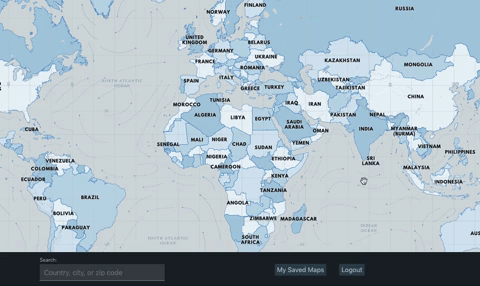
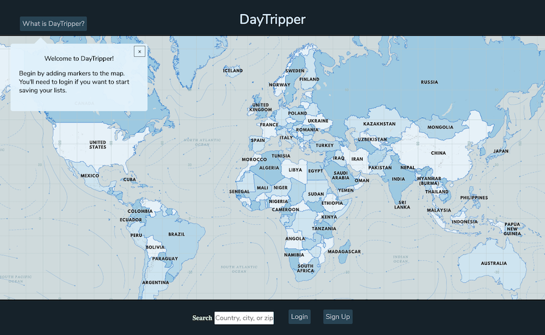
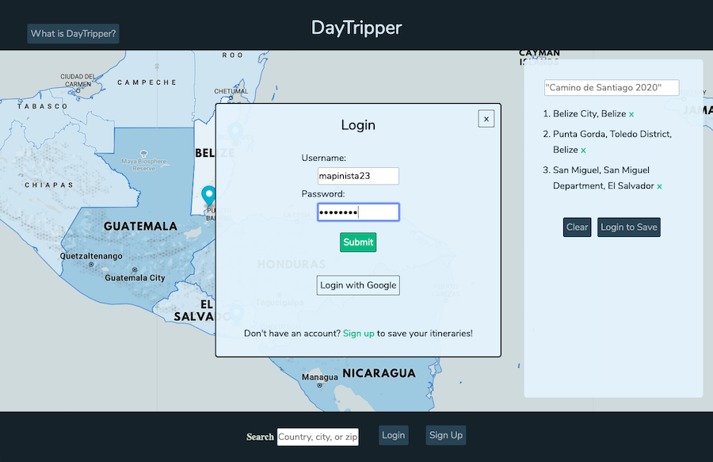

# Daytripper

## Introduction

Daytripper is a tool inspired by a love of traveling, designed for fun and exploration. Use it to plot out potential itineraries, save & remember noteworthy locales and past adventures, or just to daydream!

As a user, you can add and remove map markers with a mouse-click, name & save itineraries in the sidebar list, recall & edit your saved trips, and add details. The plan is to continue expanding the functionality to include features like:

- drag & drop reordering
- individual marker annotation
- enhanced map UI elements (lines from marker to marker, numbered markers)
- further detailing of locations (such as nearby attractions, travel & accommodation price estimates between locations)

## Implementation

### React + MapboxGL

This project is built using Node, Express, Sequelize/Postgres, React, and [MapboxGL](https://docs.mapbox.com/mapbox-gl-js/api/)'s API, with Mocha and Chai for testing. Local authentication was implemented using a server-side session, and OAuth via Google is also in place.

## Map & User Interface

On loading the application, the user sees a map of the world.

From here, users can zoom, explore, and add markers to the map to create lists. In order to save their lists they must login by either creating an account or logging in via their Google account. Once saved, the user can view or edit their itineraries.

